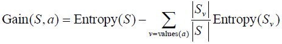
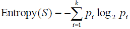
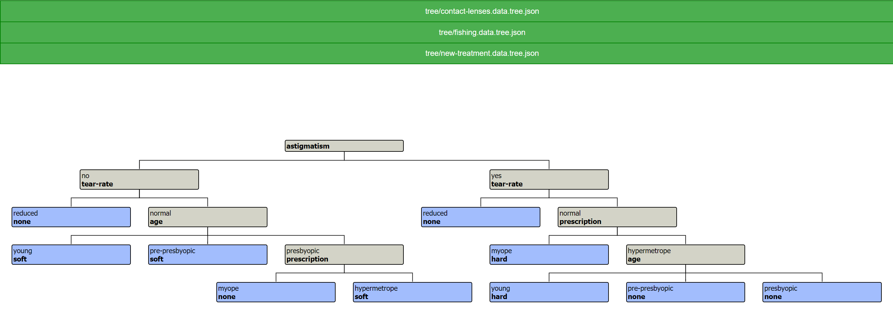
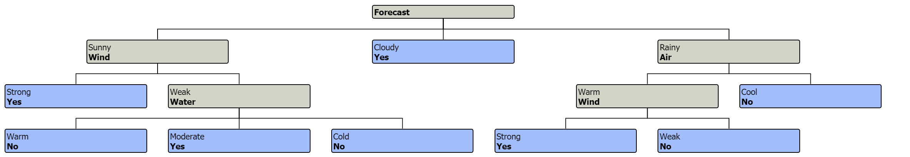
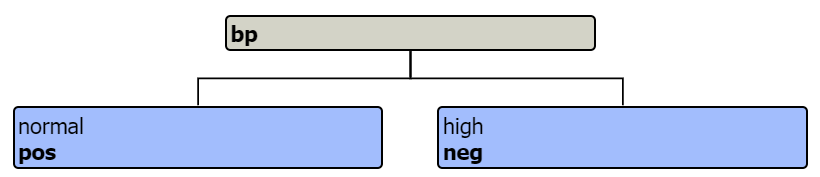

# Decisive Oak (ID3 Decision Tree Generator)

## Summary

The purpose of this project is to demonstrate an application that, given a collection of training data 
for a classification problem, generates a decision tree via the ID3 algorithm. This decision tree can be 
used to classify data in a way that is simple for a human to comprehend and the reasoning for making 
decisions is visually described by the graph drawn from the training sample.

From Wikipedia:

>In decision tree learning, ID3 (Iterative Dichotomiser 3) is an algorithm invented by Ross Quinlan used to generate a decision tree from a dataset. ID3 is the precursor to the C4.5 algorithm, and is typically used in the machine learning and natural language processing domains.

### Project Student and Course Name

*Project 3:* Decision Trees

*Student:* Daniel Wolf

*Course:* CIS 678, Winter 2020

### Implementation

*Problem:* Given data in clean, self describing format, create a decision tree that makes repeated locally 
optimal decisions on how to divide the data set by an attribute that results in the greatest descrease in 
entropy (disorder). This is also called information gain.

### Third Party Software

#### Formulas

##### Gain



##### Code

```
func gain(entropySet float64, attrValues ...AttributeValue) float64 {
	// for denominator under occurrences of each attribute value occurrence
	var setSize int
	for _, av := range attrValues {
		setSize += av.Occurrences
	}

	thisGain := entropySet
	for _, av := range attrValues {
		pOfValue := float64(av.Occurrences) / float64(setSize)
		thisGain = thisGain - (pOfValue * av.Entropy)
	}

	return thisGain
}
```

##### Entropy



##### Code

```
func entropy(occurrences []int) float64 {
	var entropy float64
	var total int
	for _, occ := range occurrences {
		// if any target has zero occurrences, entropy is 0
		if occ == 0 {
			return 0
		}
		total += occ
	}
	occurrenceRatios := make([]float64, len(occurrences))
	for i := range occurrences {
		occurrenceRatios[i] = float64(occurrences[i]) / float64(total)
	}

	for _, pOfTarget := range occurrenceRatios {
		entropy = entropy + (-1 * pOfTarget * math.Log2(pOfTarget))
	}

	return entropy
}
```

#### Organization

- parse: The parse package examines the text data files found in a data subdirectory of the current working directory where you run this application. Three example data sets are included in the repository. The attribute types, attribute values, targets, and examples are validated against the data file's stated totals as a type of validation for the parser as well as for the data file itself.
- analysis: The analysis package examines the parsed data structures in order to calculate statistics at each decision tree split, make filtering and labelling decisions for nodes, and finally the tree is output to the out folder in json format.
- data: Data includes the three examples of the standard format data inputs of raw data and final decision tree imagery examples from the server for use in this document.
- out: The out folder contains all generated outputs, including the json format for the original data and the json-formatted tree analysis itself. The server uses these to draw its diagrams after processing.
- serve: The serve package and accompanying javascript, css, and html files provide a web-based tool for displaying the decision tree final outputs in a visual format. The server searches the out folder for data and then provides the original detailed analysis via API endpoints. The javascript frontend transforms this recursively into the format required by the treant.js decision tree library:

```
function convertTree(root) {
    let chart_config = {};
    chart_config.chart = {
        container: "#oak-tree",

        nodeAlign: "BOTTOM",

        connectors: {
            type: 'step'
        },
        node: {
            HTMLclass: 'nodeExample1'
        }
    };
    chart_config.nodeStructure = convertNode(root);

    new Treant(chart_config);
}

function convertNode(node) {
    let newNode = {
        text: {
            filter: node.FilterValue,
            label: node.Label
        },
        HTMLclass: node.Terminal ? 'blue' : 'light-gray'
    };

    if (node.Children && node.Children.length > 0) {
        newNode.children = [];
        node.Children.forEach(child => {
            newNode.children.push(convertNode(child));
        });
    }

    return newNode;
}
```

#### Challenges and Considerations

- Recursive analysis of data sets requires one to take care to use newly allocated copies of arrays so that modifying one split of the data does not also modify its parent, causing the next split to be invalid.
- There is a lot of complexity in assessing recursive logic while applying math formulas at each level. To mitigate risks, I used extensive unit tests. These tested only the inputs and outputs expected from pure functions as well as derived data from data sets with previously-known metrics.

### Analysis

#### Terminal Output

While examining the training data, the terminal output describes the path of node-building as well as rationale for making 
sample splitting decisions.

```
opening data\contact-lenses.data.txt
starting first node
	best gain attribute 'astigmatism' has 2 values
	examining value no of astigmatism
starting node no astigmatism
Filtering parse sample on attribute type astigmatism, value no
pre-filter attribute type names and values:
	... age: young, pre-presbyopic, presbyopic
	... prescription: myope, hypermetrope
	... astigmatism: no, yes
	... tear-rate: reduced, normal
post-filter attribute type names and values:
	... age: young, pre-presbyopic, presbyopic
	... prescription: myope, hypermetrope
	... tear-rate: reduced, normal
	best gain attribute 'tear-rate' has 2 values
	examining value reduced of tear-rate
starting node reduced tear-rate
Filtering parse sample on attribute type tear-rate, value reduced
pre-filter attribute type names and values:
	... age: young, pre-presbyopic, presbyopic
	... prescription: myope, hypermetrope
	... tear-rate: reduced, normal
post-filter attribute type names and values:
	... age: young, pre-presbyopic, presbyopic
	... prescription: myope, hypermetrope
completed node reduced none
	examining value normal of tear-rate
starting node normal tear-rate
Filtering parse sample on attribute type tear-rate, value normal
pre-filter attribute type names and values:
	... age: young, pre-presbyopic, presbyopic
	... prescription: myope, hypermetrope
	... tear-rate: reduced, normal
post-filter attribute type names and values:
	... age: young, pre-presbyopic, presbyopic
	... prescription: myope, hypermetrope
	best gain attribute 'age' has 3 values
	examining value young of age
starting node young age
Filtering parse sample on attribute type age, value young
pre-filter attribute type names and values:
	... age: young, pre-presbyopic, presbyopic
	... prescription: myope, hypermetrope
post-filter attribute type names and values:
	... prescription: myope, hypermetrope
completed node young soft
	examining value pre-presbyopic of age
starting node pre-presbyopic age
Filtering parse sample on attribute type age, value pre-presbyopic
pre-filter attribute type names and values:
	... age: young, pre-presbyopic, presbyopic
	... prescription: myope, hypermetrope
post-filter attribute type names and values:
	... prescription: myope, hypermetrope
completed node pre-presbyopic soft
	examining value presbyopic of age
starting node presbyopic age
Filtering parse sample on attribute type age, value presbyopic
pre-filter attribute type names and values:
	... age: young, pre-presbyopic, presbyopic
	... prescription: myope, hypermetrope
post-filter attribute type names and values:
	... prescription: myope, hypermetrope
	best gain attribute 'prescription' has 2 values
	examining value myope of prescription
starting node myope prescription
Filtering parse sample on attribute type prescription, value myope
pre-filter attribute type names and values:
	... prescription: myope, hypermetrope
post-filter attribute type names and values:
completed node myope none
	examining value hypermetrope of prescription
starting node hypermetrope prescription
Filtering parse sample on attribute type prescription, value hypermetrope
pre-filter attribute type names and values:
	... prescription: myope, hypermetrope
post-filter attribute type names and values:
completed node hypermetrope soft
completed node presbyopic prescription
completed node normal age
completed node no tear-rate
	examining value yes of astigmatism
starting node yes astigmatism
Filtering parse sample on attribute type astigmatism, value yes
pre-filter attribute type names and values:
	... age: young, pre-presbyopic, presbyopic
	... prescription: myope, hypermetrope
	... astigmatism: no, yes
	... tear-rate: reduced, normal
post-filter attribute type names and values:
	... age: young, pre-presbyopic, presbyopic
	... prescription: myope, hypermetrope
	... tear-rate: reduced, normal
	best gain attribute 'tear-rate' has 2 values
	examining value reduced of tear-rate
starting node reduced tear-rate
Filtering parse sample on attribute type tear-rate, value reduced
pre-filter attribute type names and values:
	... age: young, pre-presbyopic, presbyopic
	... prescription: myope, hypermetrope
	... tear-rate: reduced, normal
post-filter attribute type names and values:
	... age: young, pre-presbyopic, presbyopic
	... prescription: myope, hypermetrope
completed node reduced none
	examining value normal of tear-rate
starting node normal tear-rate
Filtering parse sample on attribute type tear-rate, value normal
pre-filter attribute type names and values:
	... age: young, pre-presbyopic, presbyopic
	... prescription: myope, hypermetrope
	... tear-rate: reduced, normal
post-filter attribute type names and values:
	... age: young, pre-presbyopic, presbyopic
	... prescription: myope, hypermetrope
	best gain attribute 'prescription' has 2 values
	examining value myope of prescription
starting node myope prescription
Filtering parse sample on attribute type prescription, value myope
pre-filter attribute type names and values:
	... age: young, pre-presbyopic, presbyopic
	... prescription: myope, hypermetrope
post-filter attribute type names and values:
	... age: young, pre-presbyopic, presbyopic
completed node myope hard
	examining value hypermetrope of prescription
starting node hypermetrope prescription
Filtering parse sample on attribute type prescription, value hypermetrope
pre-filter attribute type names and values:
	... age: young, pre-presbyopic, presbyopic
	... prescription: myope, hypermetrope
post-filter attribute type names and values:
	... age: young, pre-presbyopic, presbyopic
	best gain attribute 'age' has 3 values
	examining value young of age
starting node young age
Filtering parse sample on attribute type age, value young
pre-filter attribute type names and values:
	... age: young, pre-presbyopic, presbyopic
post-filter attribute type names and values:
completed node young hard
	examining value pre-presbyopic of age
starting node pre-presbyopic age
Filtering parse sample on attribute type age, value pre-presbyopic
pre-filter attribute type names and values:
	... age: young, pre-presbyopic, presbyopic
post-filter attribute type names and values:
completed node pre-presbyopic none
	examining value presbyopic of age
starting node presbyopic age
Filtering parse sample on attribute type age, value presbyopic
pre-filter attribute type names and values:
	... age: young, pre-presbyopic, presbyopic
post-filter attribute type names and values:
completed node presbyopic none
completed node hypermetrope age
completed node normal prescription
completed node yes tear-rate
completed node  astigmatism
Wrote out/contact-lenses.data.tree.json

opening data\fishing.data.txt
starting first node
	best gain attribute 'Forecast' has 3 values
	examining value Sunny of Forecast
starting node Sunny Forecast
Filtering parse sample on attribute type Forecast, value Sunny
pre-filter attribute type names and values:
	... Wind: Strong, Weak
	... Water: Warm, Moderate, Cold
	... Air: Warm, Cool
	... Forecast: Sunny, Cloudy, Rainy
post-filter attribute type names and values:
	... Wind: Strong, Weak
	... Water: Warm, Moderate, Cold
	... Air: Warm, Cool
	best gain attribute 'Wind' has 2 values
	examining value Strong of Wind
starting node Strong Wind
Filtering parse sample on attribute type Wind, value Strong
pre-filter attribute type names and values:
	... Wind: Strong, Weak
	... Water: Warm, Moderate, Cold
	... Air: Warm, Cool
post-filter attribute type names and values:
	... Water: Warm, Moderate, Cold
	... Air: Warm, Cool
completed node Strong Yes
	examining value Weak of Wind
starting node Weak Wind
Filtering parse sample on attribute type Wind, value Weak
pre-filter attribute type names and values:
	... Wind: Strong, Weak
	... Water: Warm, Moderate, Cold
	... Air: Warm, Cool
post-filter attribute type names and values:
	... Water: Warm, Moderate, Cold
	... Air: Warm, Cool
	best gain attribute 'Water' has 3 values
	examining value Warm of Water
starting node Warm Water
Filtering parse sample on attribute type Water, value Warm
pre-filter attribute type names and values:
	... Water: Warm, Moderate, Cold
	... Air: Warm, Cool
post-filter attribute type names and values:
	... Air: Warm, Cool
completed node Warm No
	examining value Moderate of Water
starting node Moderate Water
Filtering parse sample on attribute type Water, value Moderate
pre-filter attribute type names and values:
	... Water: Warm, Moderate, Cold
	... Air: Warm, Cool
post-filter attribute type names and values:
	... Air: Warm, Cool
completed node Moderate Yes
	examining value Cold of Water
starting node Cold Water
Filtering parse sample on attribute type Water, value Cold
pre-filter attribute type names and values:
	... Water: Warm, Moderate, Cold
	... Air: Warm, Cool
post-filter attribute type names and values:
	... Air: Warm, Cool
completed node Cold No
completed node Weak Water
completed node Sunny Wind
	examining value Cloudy of Forecast
starting node Cloudy Forecast
Filtering parse sample on attribute type Forecast, value Cloudy
pre-filter attribute type names and values:
	... Wind: Strong, Weak
	... Water: Warm, Moderate, Cold
	... Air: Warm, Cool
	... Forecast: Sunny, Cloudy, Rainy
post-filter attribute type names and values:
	... Wind: Strong, Weak
	... Water: Warm, Moderate, Cold
	... Air: Warm, Cool
completed node Cloudy Yes
	examining value Rainy of Forecast
starting node Rainy Forecast
Filtering parse sample on attribute type Forecast, value Rainy
pre-filter attribute type names and values:
	... Wind: Strong, Weak
	... Water: Warm, Moderate, Cold
	... Air: Warm, Cool
	... Forecast: Sunny, Cloudy, Rainy
post-filter attribute type names and values:
	... Wind: Strong, Weak
	... Water: Warm, Moderate, Cold
	... Air: Warm, Cool
	best gain attribute 'Air' has 2 values
	examining value Warm of Air
starting node Warm Air
Filtering parse sample on attribute type Air, value Warm
pre-filter attribute type names and values:
	... Wind: Strong, Weak
	... Water: Warm, Moderate, Cold
	... Air: Warm, Cool
post-filter attribute type names and values:
	... Wind: Strong, Weak
	... Water: Warm, Moderate, Cold
	best gain attribute 'Wind' has 2 values
	examining value Strong of Wind
starting node Strong Wind
Filtering parse sample on attribute type Wind, value Strong
pre-filter attribute type names and values:
	... Wind: Strong, Weak
	... Water: Warm, Moderate, Cold
post-filter attribute type names and values:
	... Water: Warm, Moderate, Cold
completed node Strong Yes
	examining value Weak of Wind
starting node Weak Wind
Filtering parse sample on attribute type Wind, value Weak
pre-filter attribute type names and values:
	... Wind: Strong, Weak
	... Water: Warm, Moderate, Cold
post-filter attribute type names and values:
	... Water: Warm, Moderate, Cold
completed node Weak No
completed node Warm Wind
	examining value Cool of Air
starting node Cool Air
Filtering parse sample on attribute type Air, value Cool
pre-filter attribute type names and values:
	... Wind: Strong, Weak
	... Water: Warm, Moderate, Cold
	... Air: Warm, Cool
post-filter attribute type names and values:
	... Wind: Strong, Weak
	... Water: Warm, Moderate, Cold
completed node Cool No
completed node Rainy Air
completed node  Forecast
Wrote out/fishing.data.tree.json

opening data\new-treatment.data.txt
starting first node
	best gain attribute 'bp' has 2 values
	examining value normal of bp
starting node normal bp
Filtering parse sample on attribute type bp, value normal
pre-filter attribute type names and values:
	... pulse: normal, rapid
	... bp: normal, high
	... age: <25, 25-40, >40
post-filter attribute type names and values:
	... pulse: normal, rapid
	... age: <25, 25-40, >40
completed node normal pos
	examining value high of bp
starting node high bp
Filtering parse sample on attribute type bp, value high
pre-filter attribute type names and values:
	... pulse: normal, rapid
	... bp: normal, high
	... age: <25, 25-40, >40
post-filter attribute type names and values:
	... pulse: normal, rapid
	... age: <25, 25-40, >40
completed node high neg
completed node  bp
Wrote out/new-treatment.data.tree.json
```

#### Graphical Trees and Server

By running the `Serve.ps1` script, you can see the tree graph for any tree generated via the commandline by
navigating to http://localhost:3000 While the Go server does not handle timeouts or do extensive error handling, it can run securely behind a reverse proxy such as IIS, Apache, Nginx, or Caddy. If running without a proxy, one should only use it locally or on a secure network.

A list endpoint reports all the tree files it finds in the out folder so that the frontend can build a dynamic menu. See the first chart example below for the menu. This tree data is located by the server's glob pattern which searches the out directory for tree json files and presents them upon request.

#### Contact Lens

Raw parse data is stored in `contact-lenses.data.json` and the analysis data for the contact lens tree is output to `contact-lenses.data.tree.json`.



#### Fishing

Raw parse data is stored in `fishing.data.json` and the analysis data for the fishing tree is output to `fishing.data.tree.json`.



#### New Treatment

Raw parse data is stored in `new-treatment.data.json` and the analysis data for the new treatment tree is output to `new-treatment.data.tree.json`.



### License, Limitations, and Usage

The purpose of this project was academic in nature. I don't recommend using 
this code in production. I have licensed this code with an MIT license, so 
reuse is permissible. If you are in an academic institution, you might have 
additional guidelines to follow.
